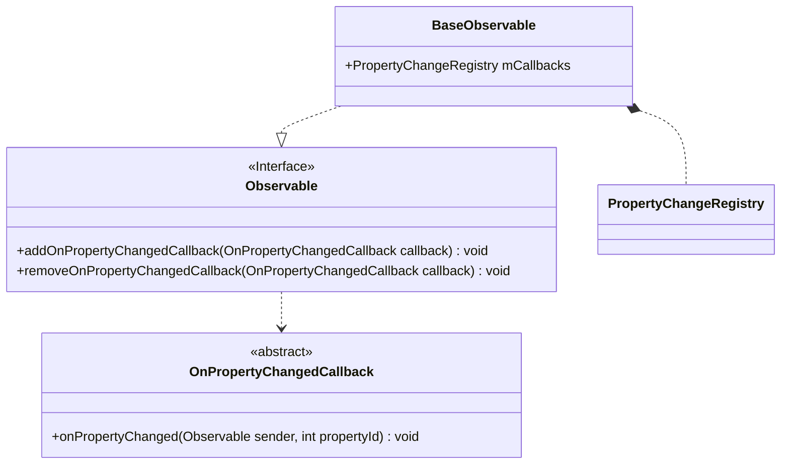

```mermaid
classDiagram
class Observable{
<<Interface>>
	+addOnPropertyChangedCallback(OnPropertyChangedCallback callback) void
	+removeOnPropertyChangedCallback(OnPropertyChangedCallback callback)void
}
class OnPropertyChangedCallback{
<<abstract>>
	+onPropertyChanged(Observable sender, int propertyId) void
}
class BaseObservable{
	 +PropertyChangeRegistry mCallbacks
}

class PropertyChangeRegistry{
	
}

Observable ..> OnPropertyChangedCallback
BaseObservable ..|> Observable
BaseObservable *.. PropertyChangeRegistry
```

