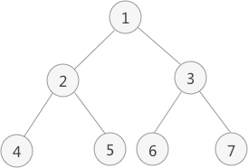
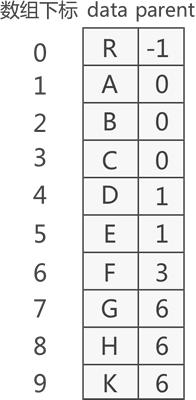

# 数据结构

数据结构，直白地理解，就是研究数据的存储方式。

## 线性表

线性表，数据结构中最简单的一种存储结构，专门用于存储逻辑关系为"一对一"的数据。

线性表可细分为:

1. 顺序表（*数据集中存储*）
2. 链表（*数据分散存储*）
   - 单向链表
   - 双向链表
   - 循环链表
   - 双向循环链表

**元素：**一组数据中的每个个体被称为“数据元素”（简称“元素”）。

**前驱：**某一元素的左侧相邻元素称为“直接前驱”，位于此元素左侧的所有元素都统称为“前驱元素”；

**后继：**某一元素的右侧相邻元素称为“直接后继”，位于此元素右侧的所有元素都统称为“后继元素”；

### 顺序表

将“具有 '一对一' 逻辑关系的数据按照次序连续存储到一整块物理空间上”的存储结构就是顺序存储结构。顺序表存储数据同数组非常接近。其实，顺序表存储数据使用的就是数组。

顺序表中需要记录的关键数据：

- 表的容量，既申请空间的大小
- 有效数据的长度，既存储的元素个数

#### 顺序表的基本操作

- 插入（将要插入位置元素以及后续的元素整体向后移动一个位置，将元素放到腾出来的位置上）

  1. 插入到顺序表的表头；
  2. 在表的中间位置插入元素；
  3. 尾随顺序表中已有元素，作为顺序表中的最后一个元素；

- 删除（只需找到目标元素，并将其后续所有元素整体前移 1 个位置即可）

- 查找（遍历）

- 修改（更新）

  1. 找到目标元素；
  2. 直接修改该元素的值；
### 链表

链表不限制数据的物理存储状态，换句话说，使用链表存储的数据元素，其物理存储位置是随机的。

#### 单链

数据元素随机存储，并通过指针表示数据之间逻辑关系的存储结构就是链式存储结构，如果只有指向后继的指针没有指向前驱的指针，这种链式结构称为单链结构；

**链表的节点：**单链的节点由两部分组成

1. 数据元素本身，其所在的区域称为数据域；

2. 指向直接后继元素的指针，所在的区域称为指针域；

```java
class Node{
		Object data;
		Object next;
}
```

   

1. 头指针：一个普通的指针，它的特点是永远指向链表第一个节点的位置。很明显，头指针用于指明链表的位置，便于后期找到链表并使用表中的数据；
2. 节点：链表中的节点又细分为头节点、首元节点和其他节点：
   - 头节点：其实就是一个不存任何数据的空节点，通常作为链表的第一个节点。对于链表来说，头节点不是必须的，它的作用只是为了方便解决某些实际问题；
   - 首元节点：由于头节点（也就是空节点）的缘故，链表中称第一个存有数据的节点为首元节点。首元节点只是对链表中第一个存有数据节点的一个称谓，没有实际意义；
   - 其他节点：链表中其他的节点；


##### 链表的基本操作
- **链表插入元素**
  1. 将新结点的 next 指针指向插入位置后的结点；
  2. 将插入位置前结点的 next 指针指向插入结点；


  

> 注意：链表插入元素的操作必须是先步骤 1，再步骤 2；反之，若先执行步骤 2，除非再添加一个指针，作为插入位置后续链表的头指针，否则会导致插入位置后的这部分链表丢失，无法再实现步骤 1。

- **链表删除元素**

  1. 将结点从链表中摘下来;
  2. 手动释放掉结点，回收被结点占用的存储空间;

- **链表查找元素**

  从表头依次遍历表中节点，用被查找元素与各节点数据域中存储的数据元素进行比对，直至比对成功或遍历至链表最末端的 `NULL`（比对失败的标志）。

- **链表更新元素**

  更新链表中的元素，只需通过遍历找到存储此元素的节点，对节点中的数据域做更改操作即可。

#### 静态链（需要进一步学习）

静态链表，也是线性存储结构的一种，它兼顾了顺序表和链表的优点于一身，可以看做是顺序表和链表的升级版。

#### 双向链表

双向链表在单链的基础上多指向前驱的游标，能够快速定位到某一个元素的前驱；

结构示意图如下


双链的基本操作和单链的基本操作类似；参照单链即可；

#### 单向环形链表

虽然循环链表成环状，但本质上还是链表，因此在循环链表中，依然能够找到头指针和首元节点等。循环链表和普通链表相比，唯一的不同就是循环链表首尾相连，其他都完全一样。


## 栈和队列

栈和队列，严格意义上来说，也属于线性表，因为它们也都用于存储逻辑关系为 "一对一" 的数据，但由于它们比较特殊，因此将其单独作为一章，做重点讲解。

使用栈结构存储数据，讲究“先进后出”，即最先进栈的数据，最后出栈；使用队列存储数据，讲究 "先进先出"，即最先进队列的数据，也最先出队列。

既然栈和队列都属于线性表，根据线性表分为顺序表和链表的特点，栈也可分为顺序栈和链表，队列也分为顺序队列和链队列，这些内容都会在本章做详细讲解。

### 栈（stack）

栈是一种特殊的线性表，可以看着是线性表的一端封闭。所以栈是先进后出；


栈可以用顺序表或者链表实现

**栈的操作**

**入栈：**向栈中添加元素

**出栈：**从栈中提取出指定元素

### 队列（queue）

队列的两端都"开口"，要求数据只能从一端进，从另一端出


**队列的操作**

**入队：**向队列中添加元素

**出队：**在队列中取出元素

#### 顺序队列


顺序队列由于其存储结构的影响，会出现空间用完以及空间不能回收的问题，因此使用顺序队列时可以设计为环形结构，以充分回收利用分配的空间


就算设计成环形，存储空间也会有问题。。空间大小难以确认

#### 链式队列

链式队列的实现思想同顺序队列类似，只需创建两个指针（命名为 top 和 rear）分别指向链表中队列的队头元素和队尾元素

## 串

字符串要单独用一种存储结构来存储，称为串存储结构。这里的串指的就是字符串。严格意义上讲，串存储结构也是一种线性存储结构，因为字符串中的字符之间也具有"一对一"的逻辑关系。只不过，与之前所学的线性存储结构不同，串结构只用于存储字符类型的数据。

**空串：**存储 0 个字符的串，例如 S = ""（双引号紧挨着）

**空格串：**只包含空格字符的串，例如 S = "   "（双引号包含 5 个空格）;

**主串和子串：**假设有两个串 a 和 b，如果 a 中可以找到几个连续字符组成的串与 b 完全相同，则称 a 是 b 的主串，b 是 a 的子串。例如，若 a = "shujujiegou"，b = "shuju"，由于 a 中也包含 "shuju"，因此串 a 和串 b 是主串和子串的关系；

### 串的匹配算法

#### **BF算法**

普通模式匹配算法，其实现过程没有任何技巧，就是简单粗暴地拿一个串同另一个串中的字符一一比对，得到最终结果。


#### KMP算法（待学习）

## 数组和广义表（延后学习）

## 树存储结构

数据结构的树存储结构，常用于存储逻辑关系为 "一对多" 的数据。


**结点：**使用树结构存储的每一个数据元素都被称为“结点”。

**树根结点**（简称“根结点”）：每一个非空树都有且只有一个被称为根的结点。

**叶子结点：**如果结点没有任何子结点，那么此结点称为叶子结点（叶结点）。

**空树：**如果集合本身为空，那么构成的树就被称为空树。空树中没有结点。

> 补充：在树结构中，对于具有同一个根结点的各个子树，相互之间不能有交集。例如，图 1（A）中，除了根结点 A，其余元素又各自构成了三个子树，根结点分别为 B、C、D，这三个子树相互之间没有相同的结点。如果有，就破坏了树的结构，不能算做是一棵树。

**度：**对于一个结点，拥有的子树数（结点有多少分支）称为结点的度（Degree）。

**结点层次：**一棵树的深度（高度）是树中结点所在的最大的层次。

**有序树和无序树：**如果树中结点的子树从左到右看，谁在左边，谁在右边，是有规定的，这棵树称为有序树；反之称为无序树。

> 在有序树中，一个结点最左边的子树称为"第一个孩子"，最右边的称为"最后一个孩子"。

**森林：**由 m（m >= 0）个互不相交的树组成的集合被称为森林。

**树的表示：**


### 二叉树

满足以下两个条件的树称为二叉树：

1. 本身是有序树；
2. 树中包含的各个节点的度不能超过 2，即只能是 0、1 或者 2；

**二叉树的性质**

1. 二叉树中，第 i 层最多有 2i-1 个结点。
2. 如果二叉树的深度为 K，那么此二叉树最多有 2K-1 个结点。
3. 二叉树中，终端结点数（叶子结点数）为 n0，度为 2 的结点数为 n2，则 n0=n2+1。

**满二叉树：**如果二叉树中除了叶子结点，每个结点的度都为 2，则此二叉树称为满二叉树。

**完全二叉树:**如果二叉树中除去最后一层节点为满二叉树，且最后一层的结点依次从左到右分布，则此二叉树被称为完全二叉树

#### 二叉树的存储结构

##### 顺序存储结构

二叉树的顺序存储，指的是使用[顺序表](http://c.biancheng.net/view/3334.html)（数组）存储二叉树。需要注意的是，顺序存储只适用于完全二叉树。换句话说，只有完全二叉树才可以使用顺序表存储。因此，如果我们想顺序存储普通二叉树，需要提前将普通二叉树转化为完全二叉树。

完全二叉树的顺序存储，仅需从根节点开始，按照层次依次将树中节点存储到数组即可。

存储示意图：


##### 树结构的链式存储

​	采用链式存储二叉树时，其节点结构由 3 部分构成（如图 3 所示）：

- 指向左孩子节点的指针（Lchild）；
- 节点存储的数据（data）；
- 指向右孩子节点的指针（Rchild）；

链式存储结构示意图


节点：


#### 二叉树的遍历方法



二叉树的四中遍历方法可以看做是读取当前节点数据的时机；

如上图所是的二叉树以4种不同的遍历，所得的结果如下；

**先序遍历：**是指先读取当前节点的值，再读取左边节点的值，最后读取右边节点的值，读取结果是

1 2 4 5 3 6 7 ；

**中序遍历：**是指先读取左边节点的值，然后读取当前节点的值，最后读取右边节点的值得遍历方式；读取结果为

4 2 5 1 6 3 7 ；

**后序遍历：**是指先读取左边节点的值，再读取右边节点的值，最后才读取当前节点的值；读取结果为

4 5 2 6 7 3 1；

**层次遍历：**是以层为单位进行遍历；

1 2 3 4 5 6 7；

#### 线索二叉树

线索二叉树是指在遍历的同时，使用二叉树中空闲的内存空间记录某些结点的前趋和后继元素的位置（不是全部）。这样在算法后期需要遍历二叉树时，就可以利用保存的结点信息，提高了遍历的效率。使用这种方法构建的二叉树，即为“线索二叉树”。

**存储密度**指的是数据本身所占的存储空间和整个结点结构所占的存储量之比。

线索二叉树的节点结构：


LTag 和 RTag 为标志域。实际上就是两个布尔类型的变量：

- LTag 值为 0 时，表示 lchild 指针域指向的是该结点的左孩子；为 1 时，表示指向的是该结点的直接前趋结点；
- RTag 值为 0 时，表示 rchild 指针域指向的是该结点的右孩子；为 1 时，表示指向的是该结点的直接后继结点

##### 双向线索二叉树

双向线索二叉树是在数据节点中说增加两个指针，指向前驱和后继，以便在遍历时能直接找到前驱和后继

图解：


## 树的存储表示

**双亲表示法：**双亲表示法采用顺序表（也就是数组）存储普通树，其实现的核心思想是：顺序存储各个节点的同时，给各节点附加一个记录其父节点位置的变量。



**孩子表示法：**孩子表示法存储普通树采用的是 "顺序表+链表" 的组合结构，其存储过程是：从树的根节点开始，使用顺序表依次存储树中各个节点，需要注意的是，与双亲表示法不同，孩子表示法会给各个节点配备一个链表，用于存储各节点的孩子节点位于顺序表中的位置。


**树的孩子兄弟表示法：**孩子兄弟表示法，采用的是[链式存储结构](http://c.biancheng.net/view/3336.html)，其存储树的实现思想是：从树的根节点开始，依次用[链表](http://c.biancheng.net/view/3336.html)存储各个节点的孩子节点和兄弟节点。


该链表中的节点应包含以下 3 部分内容（如图 2 所示）：

1. 节点的值；
2. 指向孩子节点的指针；
3. 指向兄弟节点的指针；

树的孩子兄弟表示法使用的节点示意图


如上的图可以表示为：


## 森林转换为二叉树

1. 首先将森林中所有的普通树各自转化为二叉树；
2. 将森林中第一棵树的树根作为整个森林的树根，其他树的根节点看作是第一棵树根节点的兄弟节点，采用孩子兄弟表示法将所有树进行连接；


## 哈夫曼树（最优二叉树）

**路径：**在一棵树中，一个结点到另一个结点之间的通路，称为路径。

**路径长度**：在一条路径中，每经过一个结点，路径长度都要加 1 。

**结点的权：**给每一个结点赋予一个新的数值，被称为这个结点的权。

**结点的带权路径长度：**指的是从根结点到该结点之间的路径长度与该结点的权的乘积


**构建哈夫曼树的过程：**

对于给定的有各自权值的 n 个结点，构建哈夫曼树有一个行之有效的办法：

1. 在 n 个权值中选出两个最小的权值，对应的两个结点组成一个新的二叉树，且新二叉树的根结点的权值为左右孩子权值的和；
2. 在原有的 n 个权值中删除那两个最小的权值，同时将新的权值加入到 n–2 个权值的行列中，以此类推；
3. 重复 1 和 2 ，直到所以的结点构建成了一棵二叉树为止，这棵树就是哈夫曼树。


